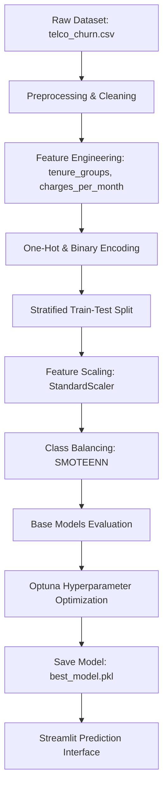

# 📞 Telecom Customer Churn Prediction Model

[](https://www.python.org/)
[](https://streamlit.io/)
[](https://scikit-learn.org/)
[](https://www.kaggle.com/datasets/blastchar/telco-customer-churn)

An end-to-end Machine Learning system that predicts which telecom customers are likely to churn (cancel their subscriptions). It includes data pipeline scripting, visual exploratory data analysis (EDA), model comparisons, hyperparameter tuning with Optuna, and an interactive Streamlit dashboard.

---

## 📌 Problem Statement
Customer churn is a critical metric for telecommunications companies. Acquiring a new customer is significantly more expensive than retaining an existing one. By predicting which customers are at risk of leaving, the business can proactively apply retention strategies (such as billing discounts, customer support check-ins, or contract upgrades) to prevent churn and protect revenue.

---

## 🧬 System Architecture


---

## 📊 Model Performance Comparison

The classifiers were trained on balanced sets and evaluated on the original, imbalanced test dataset. Our priority target was **Recall for Churn Class (1)** (minimizing false negatives) alongside **ROC-AUC** (discriminative power).

| Model | Balancing | Accuracy | Precision | Recall (Class 1) | F1-Score | ROC-AUC |
| :--- | :--- | :---: | :---: | :---: | :---: | :---: |
| **Logistic Regression (Tuned)** | **SMOTEENN** | **70.19%** | **46.72%** | **87.70%** | **60.97%** | **0.8326** |
| Logistic Regression (Base) | SMOTEENN | 70.19% | 46.68% | 86.36% | 60.60% | 0.8321 |
| Random Forest (Base) | SMOTEENN | 72.04% | 48.47% | 84.76% | 61.67% | 0.8349 |
| LightGBM (Base) | SMOTEENN | 72.39% | 48.84% | 84.22% | 61.83% | 0.8322 |
| XGBoost (Base) | SMOTEENN | 71.61% | 47.94% | 81.02% | 60.24% | 0.8273 |
| Logistic Regression (Base) | SMOTE | 76.37% | 54.19% | 70.86% | 61.41% | 0.8332 |
| Decision Tree (Base) | SMOTEENN | 70.83% | 47.07% | 79.41% | 59.10% | 0.7357 |

*Note: Models balanced using SMOTEENN performed significantly better at capturing customer churn (Recall > 80%) compared to SMOTE alone.*

---

## 💡 Key EDA Insights
1. **Contract Structure**: Month-to-month contracts have an alarmingly high churn rate of **42.71%**, compared to **11.30%** for 1-year and **2.80%** for 2-year agreements.
2. **Tenure Behavior**: The risk of churn is highly concentrated within the first 12 months. Churned customers have an average tenure of **18.0 months** vs **37.6 months** for loyal customers.
3. **Billing Pressure**: Churned customers have higher average monthly charges (**$74.44**) than retained customers (**$61.27**).
4. **Internet Medium**: Subscribers on **Fiber Optic** lines show a churn rate of **41.89%** (compared to **18.96%** for DSL), indicating potential cost sensitivity or quality issues.
5. **Billing Method**: Customers paying via **Electronic Check** show a **45.30%** churn rate, while automated options (Credit Cards / Bank Transfers) have only **15.0% - 16.0%** churn rates.

---

## 🚀 Installation & Local Execution

### 1. Prerequisites
Ensure you have Python 3.10+ installed.

### 2. Setup Environment
Clone this repository and create a virtual environment:
```bash
python -m venv .venv
source .venv/bin/activate  # On Windows: .\.venv\Scripts\activate
```

### 3. Install Dependencies
```bash
pip install -r requirements.txt
```

### 4. Running the Pipelines
- Run **Stage 1 (EDA)** to generate reports and plots:
  ```bash
  python src/eda_analysis.py
  ```
- Run **Stage 2 (Preprocessing)** to clean and scale:
  ```bash
  python src/data_preprocessing.py
  ```
- Run **Stage 3 (Modeling)** to train, tune, and save the classifier:
  ```bash
  python src/train.py
  ```

### 5. Run Streamlit Application Locally
```bash
streamlit run app/streamlit_app.py
```
Open your browser at `http://localhost:8501`.

---
